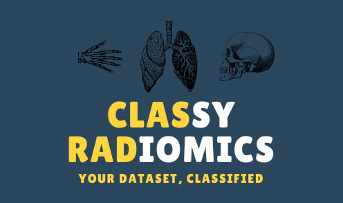

<p align="center">
<br>
  
</p>

[](https://opensource.org/licenses/Apache-2.0)
[](https://github.com/pwoznicki/ClassyRadiomics/commits/main)
[](https://codecov.io/gh/pwoznicki/ClassyRadiomics)

## Simple pipeline for experimenting with radiomics features

| <p align="center"><a href="https://share.streamlit.io/pwoznicki/classyradiomics/main/webapp/app.py"> Streamlit Share | <p align="center"><a href="https://hub.docker.com/repository/docker/piotrekwoznicki/classy-radiomics"> Docker   | <p align="center"><a href="https://pypi.org/project/classrad/"> Python                                           |
| -------------------------------------------------------------------------------------------------------------------- | --------------------------------------------------------------------------------------------------------------- | ---------------------------------------------------------------------------------------------------------------- |
| <p align="center"></p>  | <p align="center"></p> | <p align="center"></p> |
| <p align="center"><a href="https://share.streamlit.io/pwoznicki/classyradiomics/main/webapp/app.py"> **Demo**        | `docker run -p 8501:8501 -v <your_data_dir>:/data -it piotrekwoznicki/classy-radiomics:0.1`                     | `pip install --upgrade classrad`                                                                                 |

&nbsp;

### Installation from source

```bash
git clone https://github.com/pwoznicki/ClassyRadiomics.git
cd ClassyRadiomics
pip install -e .
```

## Example - Hydronephrosis detection from CT images:

### Extract radiomics features and save them to CSV table

```python
df = pd.read_csv(table_dir / "paths.csv")
extractor = FeatureExtractor(
    df=df,
    out_path=(table_dir / "features.csv"),
    image_col="img_path",
    mask_col="seg_path",
)
extractor.extract_features()
```

### Create a dataset from the features table

```python
feature_df = pd.read_csv(table_dir / "features.csv")
data = Dataset(
    dataframe=feature_df,
    features=feature_cols,
    target="Hydronephrosis",
    task_name="Hydronephrosis detection"
)
data.cross_validation_split_test_from_column(
    column_name="cohort", test_value="control"
)
```

### Select classifiers to compare

```python
classifier_names = [
    "Gaussian Process Classifier",
    "Logistic Regression",
    "SVM",
    "Random Forest",
    "XGBoost",
]
classifiers = [MLClassifier(name) for name in classifier_names]
```

### Create an evaluator to train and evaluate selected classifiers

```python
evaluator = Evaluator(dataset=data, models=classifiers)
evaluator.evaluate_cross_validation()
evaluator.boxplot_by_class()
evaluator.plot_all_cross_validation()
evaluator.plot_test()
```
